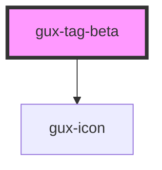

# gux-advanced-dropdown

Lorem ipsum dolor sit amet, consectetur adipiscing elit, sed do eiusmod tempor incididunt ut labore et dolore magna aliqua. Ut enim ad minim veniam, quis nostrud exercitation ullamco laboris nisi ut aliquip ex ea commodo consequat. Duis aute irure dolor in reprehenderit in voluptate velit esse cillum dolore eu fugiat nulla pariatur. Excepteur sint occaecat cupidatat non proident, sunt in culpa qui officia deserunt mollit anim id est laborum. 

<!-- Auto Generated Below -->

## Properties

| Property | Attribute | Description           | Type                                                                                                                                                                | Default     |
| -------- | --------- | --------------------- | ------------------------------------------------------------------------------------------------------------------------------------------------------------------- | ----------- |
| `color`  | `color`   | Tag background color. | `"aqua-green" \| "blue" \| "bubblegum-pink" \| "dark-purple" \| "default" \| "electric-purple" \| "fuscha" \| "lilac" \| "navy" \| "olive-green" \| "yellow-green"` | `'default'` |
| `value`  | `value`   | Index for remove tag  | `string`                                                                                                                                                            | `undefined` |

## Events

| Event       | Description                          | Type                  |
| ----------- | ------------------------------------ | --------------------- |
| `guxdelete` | Triggered when click on close button | `CustomEvent<string>` |

## Dependencies

### Depends on

- [gux-icon](../../stable/gux-icon)

### Graph

----------------------------------------------

*Built with [StencilJS](https://stenciljs.com/)*
