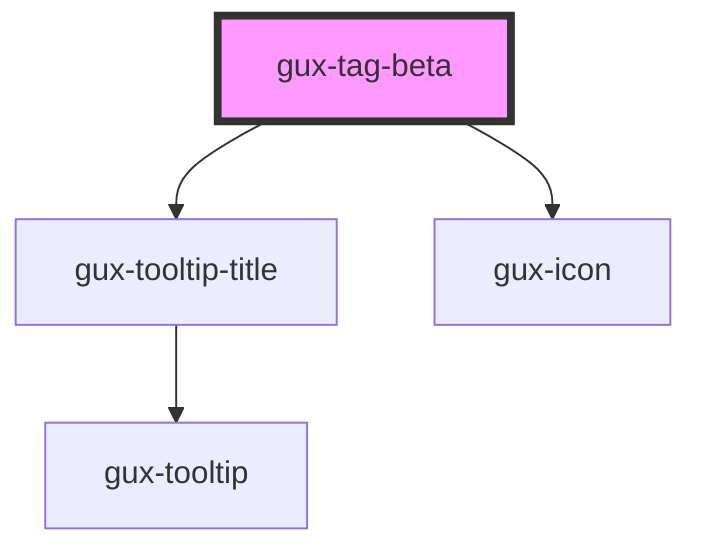

# gux-tag-beta

<!-- Auto Generated Below -->

## Properties

| Property    | Attribute   | Description           | Type                                                                                                                                                                                                       | Default     |
| ----------- | ----------- | --------------------- | ---------------------------------------------------------------------------------------------------------------------------------------------------------------------------------------------------------- | ----------- |
| `color`     | `color`     | Tag background color. | `"alert-yellow-green" \| "aqua-green" \| "blue" \| "bubblegum-pink" \| "dark-purple" \| "default" \| "default-subtle" \| "electric-purple" \| "fuscha" \| "fuchsia" \| "lilac" \| "navy" \| "olive-green"` | `'default'` |
| `disabled`  | `disabled`  | Tag is removable.     | `boolean`                                                                                                                                                                                                  | `false`     |
| `removable` | `removable` | Tag is removable.     | `boolean`                                                                                                                                                                                                  | `false`     |
| `value`     | `value`     | Index for remove tag  | `string`                                                                                                                                                                                                   | `undefined` |

## Events

| Event       | Description                           | Type                  |
| ----------- | ------------------------------------- | --------------------- |
| `guxdelete` | Triggered when click on remove button | `CustomEvent<string>` |

## Dependencies

### Depends on

- [gux-tooltip-title](../../stable/gux-tooltip-title)
- [gux-icon](../../stable/gux-icon)

### Graph

----------------------------------------------

*Built with [StencilJS](https://stenciljs.com/)*
