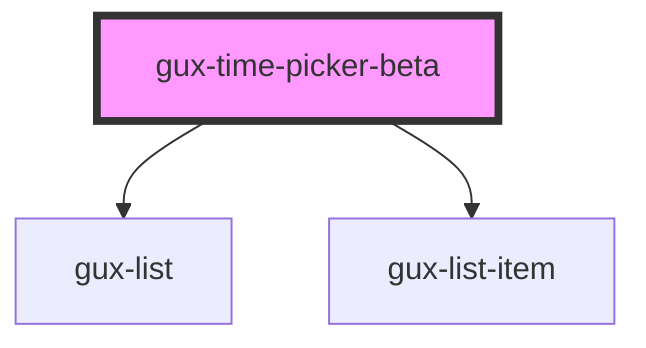

# gux-time-picker

<!-- Auto Generated Below -->

## Properties

| Property   | Attribute  | Description | Type     | Default            |
| ---------- | ---------- | ----------- | -------- | ------------------ |
| `interval` | `interval` |             | `number` | `DEFAULT_INTERVAL` |
| `label`    | `label`    |             | `string` | `''`               |
| `max`      | `max`      |             | `string` | `MAX_TIME`         |
| `min`      | `min`      |             | `string` | `MIN_TIME`         |
| `value`    | `value`    |             | `string` | `''`               |

## Events

| Event     | Description | Type                  |
| --------- | ----------- | --------------------- |
| `changed` |             | `CustomEvent<string>` |

## Dependencies

### Depends on

- [gux-list](../../stable/gux-list)
- [gux-list-item](../../stable/gux-list/gux-list-item)

### Graph

----------------------------------------------

*Built with [StencilJS](https://stenciljs.com/)*
