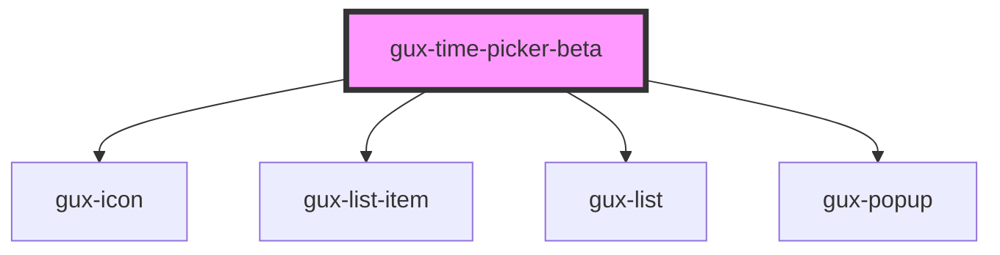

# gux-time-picker-beta

<!-- Auto Generated Below -->

## Properties

| Property    | Attribute    | Description | Type                    | Default     |
| ----------- | ------------ | ----------- | ----------------------- | ----------- |
| `clockType` | `clock-type` |             | `"12h" \| "24h"`        | `undefined` |
| `disabled`  | `disabled`   |             | `boolean`               | `false`     |
| `hasError`  | `has-error`  |             | `boolean`               | `false`     |
| `interval`  | `interval`   |             | `15 \| 30 \| 60`        | `60`        |
| `required`  | `required`   |             | `boolean`               | `false`     |
| `value`     | `value`      |             | ``${string}:${string}`` | `'00:00'`   |

## Dependencies

### Depends on

- [gux-icon](../../stable/gux-icon)
- [gux-list-item](../../stable/gux-list/gux-list-item)
- [gux-list](../../stable/gux-list)
- [gux-popup](../../stable/gux-popup)

### Graph

----------------------------------------------

*Built with [StencilJS](https://stenciljs.com/)*
