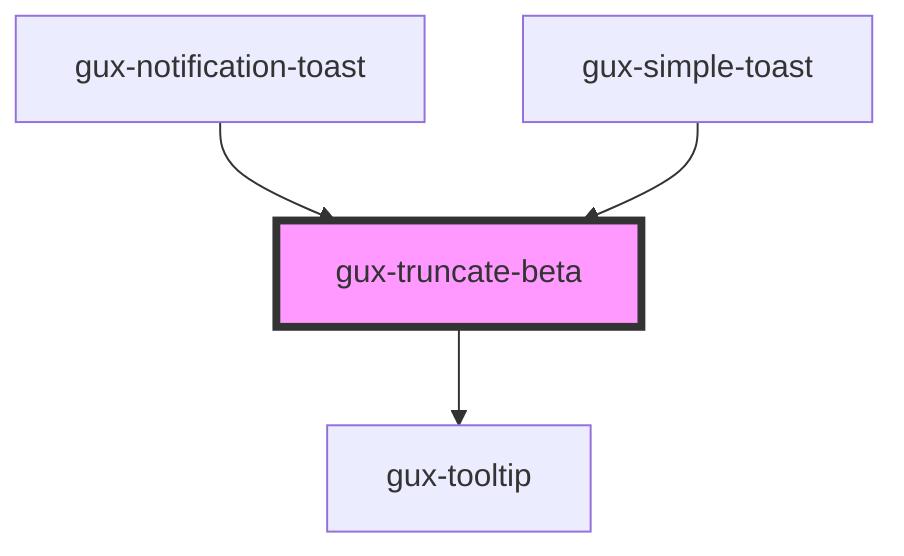

# gux-truncate

<!-- Auto Generated Below -->

## Properties

| Property   | Attribute   | Description                     | Type     | Default     |
| ---------- | ----------- | ------------------------------- | -------- | ----------- |
| `maxLines` | `max-lines` | Lines to wrap before truncating | `number` | `undefined` |

## Methods

### `setHideTooltip() => Promise<void>`

#### Returns

Type: `Promise<void>`

### `setShowTooltip() => Promise<void>`

#### Returns

Type: `Promise<void>`

## Slots

| Slot | Description                                      |
| ---- | ------------------------------------------------ |
|      | text node or element containing text to truncate |

## Dependencies

### Used by

 - [gux-notification-toast](../../stable/gux-notification-toast)
 - [gux-simple-toast](../../stable/gux-simple-toast)

### Depends on

- [gux-tooltip](../../stable/gux-tooltip)

### Graph

----------------------------------------------

*Built with [StencilJS](https://stenciljs.com/)*
