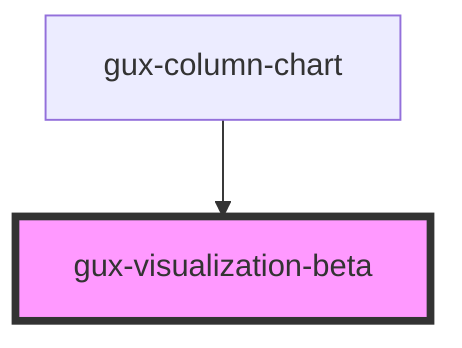

# gux-visualization-beta

<!-- Auto Generated Below -->

## Properties

| Property            | Attribute            | Description | Type                              | Default     |
| ------------------- | -------------------- | ----------- | --------------------------------- | ----------- |
| `embedOptions`      | --                   |             | `EmbedOptions<string, Renderers>` | `undefined` |
| `visualizationSpec` | `visualization-spec` |             | `string`                          | `undefined` |

## Events

| Event                 | Description | Type               |
| --------------------- | ----------- | ------------------ |
| `chartClicked`        |             | `CustomEvent<any>` |
| `chartComponentReady` |             | `CustomEvent<any>` |

## Dependencies

### Used by

 - [gux-column-chart](../gux-column-chart)

### Graph

----------------------------------------------

*Built with [StencilJS](https://stenciljs.com/)*
