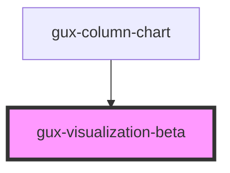

# gux-visualization-beta

<!-- Auto Generated Below -->

## Properties

| Property            | Attribute            | Description | Type                                                                                                                                                                                                                                                                                                                                                                                                                                                                                                                                                                                                                                                                                                                                                                                                                                                                                                                                                                                                                                                                                                                                                                                                                                                                                                                                                                                                                                                                                                                                                                                                                                                                                                               | Default     |
| ------------------- | -------------------- | ----------- | ------------------------------------------------------------------------------------------------------------------------------------------------------------------------------------------------------------------------------------------------------------------------------------------------------------------------------------------------------------------------------------------------------------------------------------------------------------------------------------------------------------------------------------------------------------------------------------------------------------------------------------------------------------------------------------------------------------------------------------------------------------------------------------------------------------------------------------------------------------------------------------------------------------------------------------------------------------------------------------------------------------------------------------------------------------------------------------------------------------------------------------------------------------------------------------------------------------------------------------------------------------------------------------------------------------------------------------------------------------------------------------------------------------------------------------------------------------------------------------------------------------------------------------------------------------------------------------------------------------------------------------------------------------------------------------------------------------------ | ----------- |
| `chartId`           | `chart-id`           |             | `string`                                                                                                                                                                                                                                                                                                                                                                                                                                                                                                                                                                                                                                                                                                                                                                                                                                                                                                                                                                                                                                                                                                                                                                                                                                                                                                                                                                                                                                                                                                                                                                                                                                                                                                           | `undefined` |
| `embedOptions`      | --                   |             | `EmbedOptions<string, Renderers>`                                                                                                                                                                                                                                                                                                                                                                                                                                                                                                                                                                                                                                                                                                                                                                                                                                                                                                                                                                                                                                                                                                                                                                                                                                                                                                                                                                                                                                                                                                                                                                                                                                                                                  | `undefined` |
| `spec`              | --                   |             | `GenericConcatSpec<NonNormalizedSpec> & TopLevelProperties<ExprRef \| SignalRef> & { $schema?: string; config?: Config<ExprRef \| SignalRef>; datasets?: Datasets; usermeta?: Dict<unknown>; } \| GenericFacetSpec<UnitSpecWithFrame<Field>, LayerSpec<Field>, Field> & TopLevelProperties<ExprRef \| SignalRef> & { $schema?: string; config?: Config<ExprRef \| SignalRef>; datasets?: Datasets; usermeta?: Dict<unknown>; } & DataMixins \| GenericHConcatSpec<NonNormalizedSpec> & TopLevelProperties<ExprRef \| SignalRef> & { $schema?: string; config?: Config<ExprRef \| SignalRef>; datasets?: Datasets; usermeta?: Dict<unknown>; } \| GenericUnitSpec<FacetedCompositeEncoding<Field>, AnyMark> & ResolveMixins & GenericCompositionLayout & FrameMixins<ExprRef \| SignalRef> & TopLevelProperties<ExprRef \| SignalRef> & { $schema?: string; config?: Config<ExprRef \| SignalRef>; datasets?: Datasets; usermeta?: Dict<unknown>; } & DataMixins \| GenericVConcatSpec<NonNormalizedSpec> & TopLevelProperties<ExprRef \| SignalRef> & { $schema?: string; config?: Config<ExprRef \| SignalRef>; datasets?: Datasets; usermeta?: Dict<unknown>; } \| LayerRepeatSpec & TopLevelProperties<ExprRef \| SignalRef> & { $schema?: string; config?: Config<ExprRef \| SignalRef>; datasets?: Datasets; usermeta?: Dict<unknown>; } \| LayerSpec<Field> & TopLevelProperties<ExprRef \| SignalRef> & { $schema?: string; config?: Config<ExprRef \| SignalRef>; datasets?: Datasets; usermeta?: Dict<unknown>; } \| NonLayerRepeatSpec & TopLevelProperties<ExprRef \| SignalRef> & { $schema?: string; config?: Config<ExprRef \| SignalRef>; datasets?: Datasets; usermeta?: Dict<unknown>; } \| Spec` | `undefined` |
| `visualizationSpec` | `visualization-spec` |             | `string`                                                                                                                                                                                                                                                                                                                                                                                                                                                                                                                                                                                                                                                                                                                                                                                                                                                                                                                                                                                                                                                                                                                                                                                                                                                                                                                                                                                                                                                                                                                                                                                                                                                                                                           | `undefined` |

## Dependencies

### Used by

 - [gux-column-chart](../gux-column-chart)

### Graph

----------------------------------------------

*Built with [StencilJS](https://stenciljs.com/)*
