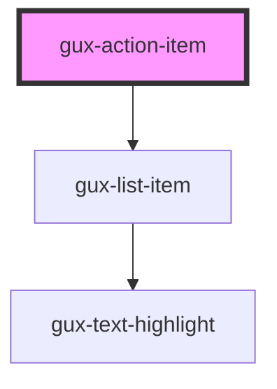

# gux-action-item

<!-- Auto Generated Below -->

## Properties

| Property | Attribute | Description                          | Type     | Default     |
| -------- | --------- | ------------------------------------ | -------- | ----------- |
| `text`   | `text`    | The value to display.                | `string` | `undefined` |
| `value`  | `value`   | The value associated with this item. | `any`    | `undefined` |

## Events

| Event   | Description                                   | Type               |
| ------- | --------------------------------------------- | ------------------ |
| `press` | Emits when the list item action is triggered. | `CustomEvent<any>` |

## Dependencies

### Depends on

- [gux-list-item](../../gux-list/list-item)

### Graph

----------------------------------------------

*Built with [StencilJS](https://stenciljs.com/)*
