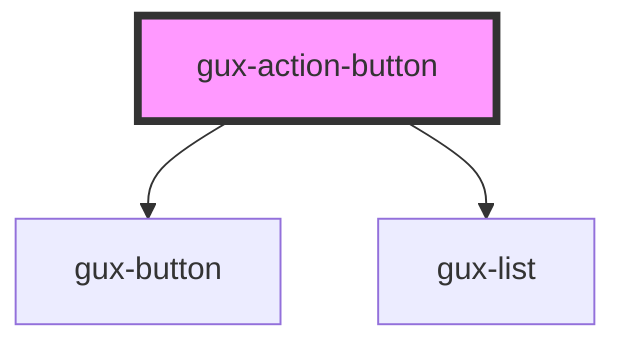

# gux-action-button

<!-- Auto Generated Below -->

## Properties

| Property   | Attribute  | Description                                                                                    | Type          | Default       |
| ---------- | ---------- | ---------------------------------------------------------------------------------------------- | ------------- | ------------- |
| `accent`   | `accent`   | The component accent (secondary or primary).                                                   | `string`      | `'secondary'` |
| `disabled` | `disabled` | Disables the action button.                                                                    | `boolean`     | `false`       |
| `isOpen`   | `is-open`  | It is used to open or not the list.                                                            | `boolean`     | `false`       |
| `items`    | --         | The list. each item should contain a text and a type an item could have the poperty isDisabled | `IListItem[]` | `[]`          |
| `text`     | `text`     | The component text.                                                                            | `string`      | `undefined`   |

## Events

| Event         | Description                                 | Type               |
| ------------- | ------------------------------------------- | ------------------ |
| `actionClick` | Triggered when the action button is clicked | `CustomEvent<any>` |
| `close`       | Triggered when the menu is close            | `CustomEvent<any>` |
| `open`        | Triggered when the menu is open             | `CustomEvent<any>` |

## Dependencies

### Depends on

- [gux-button](../gux-button)
- [gux-list](../gux-list)

### Graph

----------------------------------------------

*Built with [StencilJS](https://stenciljs.com/)*
