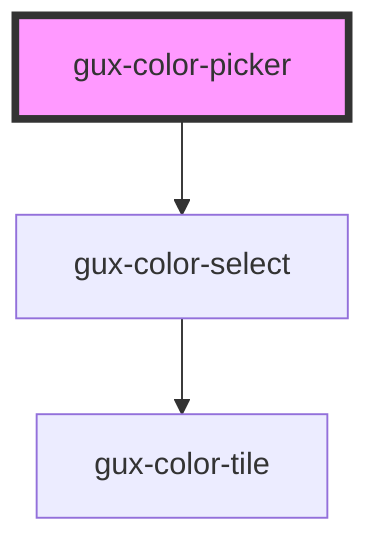

# gux-color-picker

A dropdown that displays a Color Picker menu with a color matrix and a menu item for further color customization.

<!-- Auto Generated Below -->

## Properties

| Property       | Attribute  | Description                                                        | Type       | Default     |
| -------------- | ---------- | ------------------------------------------------------------------ | ---------- | ----------- |
| `customColors` | --         | Indicates the custom Colors displayed in the color matrix dropdown | `string[]` | `[]`        |
| `disabled`     | `disabled` | Indicates if the dropdown is disabled or not                       | `boolean`  | `undefined` |
| `value`        | `value`    | Determines the state activeColor                                   | `string`   | `undefined` |

## Events

| Event   | Description                       | Type               |
| ------- | --------------------------------- | ------------------ |
| `input` | Triggers when a color is selected | `CustomEvent<any>` |

## Dependencies

### Depends on

- [gux-color-select](../gux-color-select)

### Graph

----------------------------------------------

*Built with [StencilJS](https://stenciljs.com/)*
