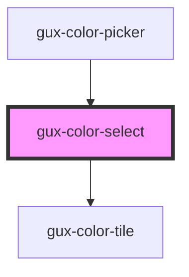

# gux-color-select

A component to select a color from a color matrix, also provides a menu item under the color matrix.

<!-- Auto Generated Below -->

## Properties

| Property       | Attribute | Description                                         | Type       | Default     |
| -------------- | --------- | --------------------------------------------------- | ---------- | ----------- |
| `customColors` | --        | Indicates the custom Colors displayed in the matrix | `string[]` | `[]`        |
| `value`        | `value`   | Determines the state activeColor                    | `string`   | `undefined` |

## Events

| Event   | Description                       | Type               |
| ------- | --------------------------------- | ------------------ |
| `input` | Triggers when a color is selected | `CustomEvent<any>` |

## Dependencies

### Used by

 - [gux-color-picker](../gux-color-picker)

### Depends on

- [gux-color-tile](tile)

### Graph

----------------------------------------------

*Built with [StencilJS](https://stenciljs.com/)*
