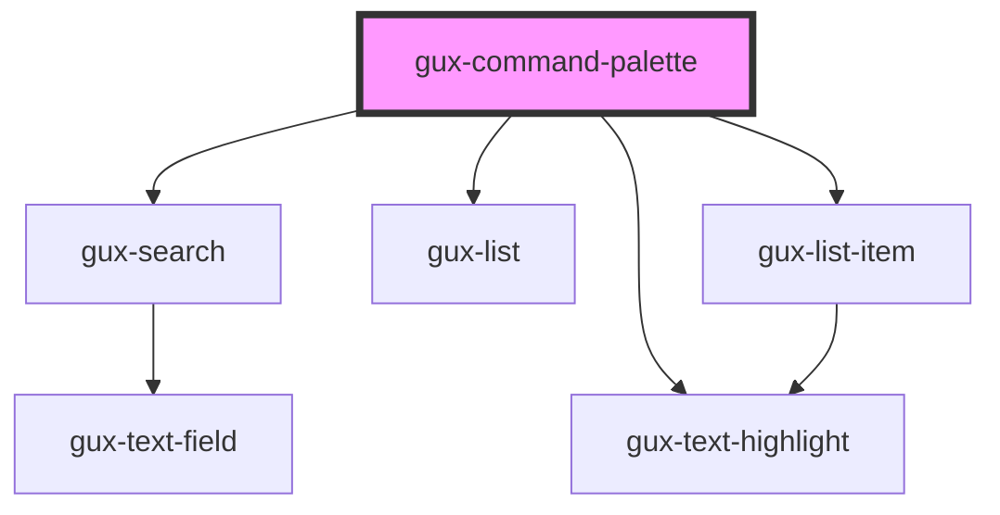

# gux-command-palette
A command palette. This control is used to display possible commands and allows for those commands to be triggered.

## Example
```xml
  <head>
    <script type="text/javascript">
      function openCommandPalette() {
        document.getElementById('palette').open();
      }
    </script>
  </head>
  <body onload="openCommandPalette()">
    <gux-command-palette id="palette">
      <gux-command-action text="test" details="shows an alert" shortcut="⌘ T"></gux-command-action>
      <gux-command-action text="test2" details="Does a thing" shortcut="⌥ T"></gux-command-action>
      <gux-command-action text="test3" shortcut="⌃ T"></gux-command-action>
      <gux-command-action text="apple" details="a fruit" common></gux-command-action>
      <gux-command-action text="banana" recent></gux-command-action>
    </gux-command-palette>
  </body>
```

<!-- Auto Generated Below -->


## Properties

| Property      | Attribute      | Description                      | Type      | Default     |
| ------------- | -------------- | -------------------------------- | --------- | ----------- |
| `filterValue` | `filter-value` | The current search value.        | `string`  | `undefined` |
| `visible`     | `visible`      | If the command palette is shown. | `boolean` | `false`     |


## Methods

### `close() => Promise<void>`

Closes the command palette.

#### Returns

Type: `Promise<void>`


### `open() => Promise<void>`

Opens the command palette.

#### Returns

Type: `Promise<void>`


## Dependencies

### Depends on

- [gux-search](../gux-search)
- [gux-list](../gux-list)
- [gux-list-item](../gux-list/list-item)
- [gux-text-highlight](../gux-list/text-highlight)

### Graph


----------------------------------------------

*Built with [StencilJS](https://stenciljs.com/)*
