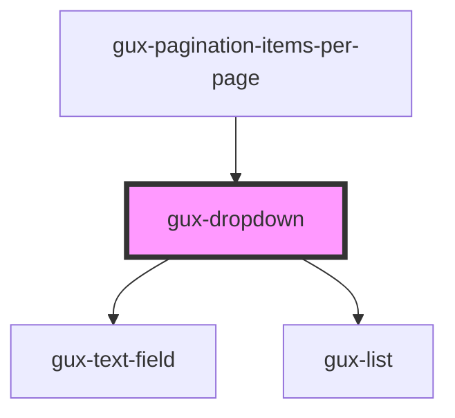

# gux-dropdown

Lorem ipsum dolor sit amet, consectetur adipiscing elit, sed do eiusmod tempor incididunt ut labore et dolore magna aliqua. Ut enim ad minim veniam, quis nostrud exercitation ullamco laboris nisi ut aliquip ex ea commodo consequat. Duis aute irure dolor in reprehenderit in voluptate velit esse cillum dolore eu fugiat nulla pariatur. Excepteur sint occaecat cupidatat non proident, sunt in culpa qui officia deserunt mollit anim id est laborum. 

<!-- Auto Generated Below -->

## Properties

| Property      | Attribute     | Description                                                    | Type          | Default     |
| ------------- | ------------- | -------------------------------------------------------------- | ------------- | ----------- |
| `disabled`    | `disabled`    | Disable the input and prevent interactions.                    | `boolean`     | `false`     |
| `filterable`  | `filterable`  | Whether the user can filter or not.                            | `boolean`     | `undefined` |
| `items`       | --            | The list items, an item contains a `text` and can be disabled. | `IListItem[]` | `[]`        |
| `mode`        | `mode`        | Sets the select mode (default, page or palette).               | `string`      | `'default'` |
| `placeholder` | `placeholder` | The dropdown placeholder.                                      | `string`      | `undefined` |
| `value`       | `value`       | Indicate the dropdown input value                              | `string`      | `''`        |

## Methods

### `setLabeledBy(labeledBy: string) => Promise<void>`

#### Returns

Type: `Promise<void>`

## Dependencies

### Used by

 - [gux-pagination-items-per-page](../gux-pagination/items-per-page)

### Depends on

- [gux-text-field](../gux-text-field)
- [gux-list](../gux-list)

### Graph

----------------------------------------------

*Built with [StencilJS](https://stenciljs.com/)*
