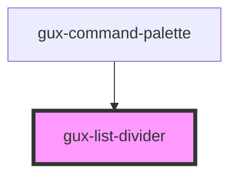

# gux-list-divider
A divider to display in a list.

<!-- Auto Generated Below -->

## Dependencies

### Used by

 - [gux-command-palette](../../gux-command-palette)

### Graph

----------------------------------------------

*Built with [StencilJS](https://stenciljs.com/)*
