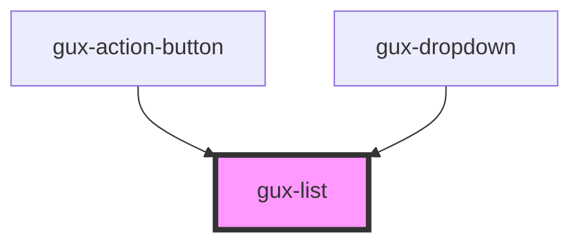

# gux-list
A list element. In order to use this element list contents must be slotted in.

Example usage
```html
<gux-list>
  <gux-list-item value="test" text="test1"/>
  <gux-list-divider/>
  <gux-list-item value="test" text="test2"/>
  <gux-list-item value="test" text="test3"/>
</gux-list>
```

Example with slotting
```html
<gux-list>
  <gux-list-item><span>⌘</span><gux-text-highlight text="test"/></gux-list-item>
</gux-list>
```

<!-- Auto Generated Below -->


## Properties

| Property    | Attribute   | Description                        | Type     | Default     |
| ----------- | ----------- | ---------------------------------- | -------- | ----------- |
| `highlight` | `highlight` | The highlight value                | `string` | `undefined` |
| `value`     | `value`     | The current selection in the list. | `any`    | `undefined` |


## Events

| Event     | Description                                     | Type               |
| --------- | ----------------------------------------------- | ------------------ |
| `changed` | Triggered when the list's selection is changed. | `CustomEvent<any>` |


## Methods

### `setFocusOnFirstItem() => Promise<void>`


#### Returns

Type: `Promise<void>`


## Dependencies

### Used by

 - [gux-action-button](../gux-action-button)
 - [gux-dropdown](../gux-dropdown)

### Graph


----------------------------------------------

*Built with [StencilJS](https://stenciljs.com/)*
