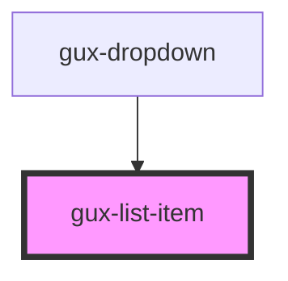

# gux-list

<!-- Auto Generated Below -->

## Properties

| Property    | Attribute   | Description | Type      | Default     |
| ----------- | ----------- | ----------- | --------- | ----------- |
| `disabled`  | `disabled`  |             | `boolean` | `false`     |
| `highlight` | `highlight` |             | `string`  | `undefined` |
| `value`     | `value`     |             | `string`  | `undefined` |

## Events

| Event    | Description | Type                       |
| -------- | ----------- | -------------------------- |
| `action` |             | `CustomEvent<HTMLElement>` |

## Dependencies

### Used by

 - [gux-dropdown](../gux-dropdown)

### Graph

----------------------------------------------

*Built with [StencilJS](https://stenciljs.com/)*
