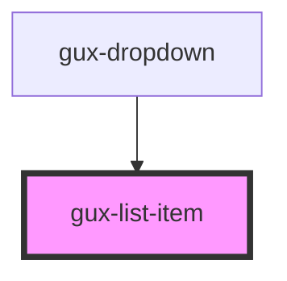

# gux-list

<!-- Auto Generated Below -->

## Properties

| Property    | Attribute   | Description             | Type      | Default     |
| ----------- | ----------- | ----------------------- | --------- | ----------- |
| `disabled`  | `disabled`  | Disables the list item. | `boolean` | `false`     |
| `highlight` | `highlight` | The highlighted text.   | `string`  | `undefined` |
| `value`     | `value`     | The value to display.   | `string`  | `undefined` |

## Events

| Event    | Description                                   | Type                       |
| -------- | --------------------------------------------- | -------------------------- |
| `action` | Emits when the list item action is triggered. | `CustomEvent<HTMLElement>` |

## Dependencies

### Used by

 - [gux-dropdown](../gux-dropdown)

### Graph

----------------------------------------------

*Built with [StencilJS](https://stenciljs.com/)*
