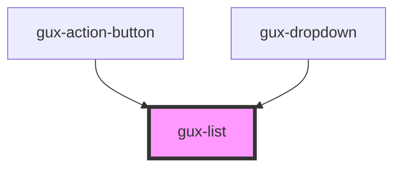

# gux-list

<!-- Auto Generated Below -->

## Properties

| Property    | Attribute   | Description                                                                                     | Type          | Default |
| ----------- | ----------- | ----------------------------------------------------------------------------------------------- | ------------- | ------- |
| `highlight` | `highlight` | Highlights to bold.                                                                             | `string`      | `''`    |
| `items`     | --          | The list. each item should contain a text and a type an item could have the property isDisabled | `IListItem[]` | `[]`    |

## Events

| Event    | Description | Type               |
| -------- | ----------- | ------------------ |
| `change` |             | `CustomEvent<any>` |

## Methods

### `setFocusOnFirstItem() => Promise<void>`

#### Returns

Type: `Promise<void>`

## Dependencies

### Used by

 - [gux-action-button](../gux-action-button)
 - [gux-dropdown](../gux-dropdown)

### Graph

----------------------------------------------

*Built with [StencilJS](https://stenciljs.com/)*
