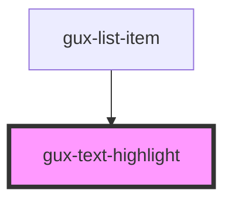

# gux-text-highlight
Displays highlightable text.

<!-- Auto Generated Below -->

## Properties

| Property    | Attribute   | Description            | Type     | Default     |
| ----------- | ----------- | ---------------------- | -------- | ----------- |
| `highlight` | `highlight` | The text to highlight. | `string` | `undefined` |
| `text`      | `text`      | The value to display.  | `string` | `undefined` |

## Dependencies

### Used by

 - [gux-list-item](../list-item)

### Graph

----------------------------------------------

*Built with [StencilJS](https://stenciljs.com/)*
