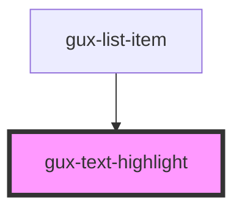

# gux-text-highlight
Displays highlightable text.

<!-- Auto Generated Below -->

## Properties

| Property | Attribute | Description           | Type     | Default     |
| -------- | --------- | --------------------- | -------- | ----------- |
| `text`   | `text`    | The value to display. | `string` | `undefined` |

## Methods

### `setHighlight(value: string) => Promise<void>`

#### Returns

Type: `Promise<void>`

## Dependencies

### Used by

 - [gux-list-item](../list-item)

### Graph

----------------------------------------------

*Built with [StencilJS](https://stenciljs.com/)*
