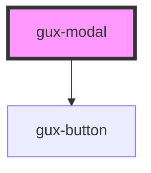

# genesys-modal

This is a basic modal component in which a user can customize the content using a slot with the name modal-content.

<!-- Auto Generated Below -->

## Properties

| Property     | Attribute     | Description                                              | Type                             | Default          |
| ------------ | ------------- | -------------------------------------------------------- | -------------------------------- | ---------------- |
| `active`     | `active`      | Indicates if modal is currently displayed                | `boolean`                        | `false`          |
| `modalTitle` | `modal-title` | Indicates the title/header for the modal                 | `string`                         | `'Modal Header'` |
| `size`       | `size`        | Indicates the size of the modal (small, medium or large) | `"large" \| "medium" \| "small"` | `undefined`      |

## Methods

### `closeModal() => Promise<void>`

#### Returns

Type: `Promise<void>`

## Dependencies

### Depends on

- [gux-button](../gux-button)

### Graph

----------------------------------------------

*Built with [StencilJS](https://stenciljs.com/)*
