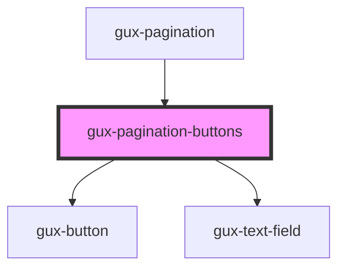

# gux-pagination-buttons

An internal component used by the gux-pagination component.

<!-- Auto Generated Below -->

## Properties

| Property      | Attribute      | Description | Type     | Default     |
| ------------- | -------------- | ----------- | -------- | ----------- |
| `currentPage` | `current-page` |             | `number` | `undefined` |
| `totalPages`  | `total-pages`  |             | `number` | `undefined` |

## Events

| Event                | Description | Type                  |
| -------------------- | ----------- | --------------------- |
| `currentPageChanged` |             | `CustomEvent<number>` |

## Dependencies

### Used by

 - [gux-pagination](..)

### Depends on

- [gux-button](../../gux-button)
- [gux-text-field](../../gux-text-field)

### Graph

----------------------------------------------

*Built with [StencilJS](https://stenciljs.com/)*
