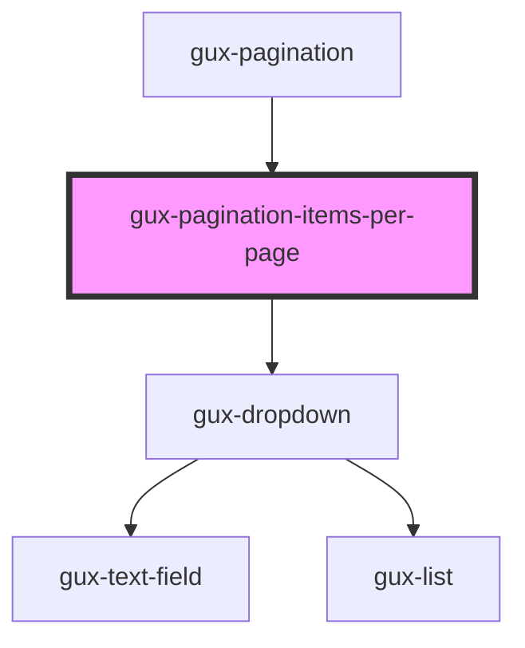

# gux-pagination-items-per-page

An internal component used by the gux-pagination component.

<!-- Auto Generated Below -->

## Properties

| Property              | Attribute        | Description | Type                                             | Default             |
| --------------------- | ---------------- | ----------- | ------------------------------------------------ | ------------------- |
| `i18n`                | --               |             | `(resourceKey: string, context?: any) => string` | `undefined`         |
| `itemsPerPage`        | `items-per-page` |             | `number`                                         | `25`                |
| `itemsPerPageOptions` | --               |             | `number[]`                                       | `[25, 50, 75, 100]` |

## Events

| Event                 | Description | Type                  |
| --------------------- | ----------- | --------------------- |
| `itemsPerPageChanged` |             | `CustomEvent<number>` |

## Methods

### `setItemsPerPage(value: number, options: number[]) => Promise<void>`

#### Returns

Type: `Promise<void>`

## Dependencies

### Used by

 - [gux-pagination](..)

### Depends on

- [gux-dropdown](../../gux-dropdown)

### Graph

----------------------------------------------

*Built with [StencilJS](https://stenciljs.com/)*
