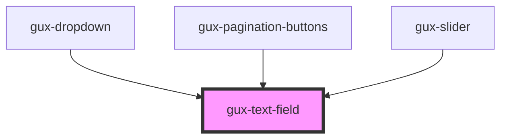

# gux-text-field

This component is an html input component having update indicator or error/warning message on it.
You can specify a validation function to add this test on input. You can do it by yourself using the input event and
changing error-message attribute.

## Example usage

``` html
<gux-text-field>
</gux-text-field>
```

<!-- Auto Generated Below -->


## Properties

| Property           | Attribute            | Description                                                                               | Type                                          | Default       |
| ------------------ | -------------------- | ----------------------------------------------------------------------------------------- | --------------------------------------------- | ------------- |
| `debounceTimeout`  | `debounce-timeout`   | Timeout between input and validation.                                                     | `number`                                      | `500`         |
| `disabled`         | `disabled`           | Disable the input and prevent interactions.                                               | `boolean`                                     | `false`       |
| `eraseLabel`       | `erase-label`        | The label for the erase button                                                            | `string`                                      | `''`          |
| `errorMessage`     | `error-message`      | The message displayed on validation failure.                                              | `string`                                      | `''`          |
| `errorMessageType` | `error-message-type` | The message type (warning or error)                                                       | `string`                                      | `Types.Error` |
| `placeholder`      | `placeholder`        | The input placeholder.                                                                    | `string`                                      | `undefined`   |
| `readonly`         | `readonly`           | Set the input in readonly mode                                                            | `boolean`                                     | `false`       |
| `type`             | `type`               | Indicate the input type                                                                   | `"email" \| "number" \| "password" \| "text"` | `'text'`      |
| `useClearButton`   | `use-clear-button`   | Determines whether or not the 'x' clear button is displayed when the input contains text. | `boolean`                                     | `true`        |
| `validation`       | `validation`         | The input validation.                                                                     | `any`                                         | `null`        |
| `value`            | `value`              | Indicate the input value                                                                  | `string`                                      | `''`          |


## Events

| Event   | Description                 | Type               |
| ------- | --------------------------- | ------------------ |
| `input` | Triggered when user inputs. | `CustomEvent<any>` |


## Methods

### `clear() => Promise<void>`

Clears the input.

#### Returns

Type: `Promise<void>`


### `setLabeledBy(id: string) => Promise<void>`


#### Returns

Type: `Promise<void>`


## Dependencies

### Used by

 - [gux-dropdown](../gux-dropdown)
 - [gux-pagination-buttons](../gux-pagination/buttons)
 - [gux-slider](../gux-slider)

### Graph


----------------------------------------------

*Built with [StencilJS](https://stenciljs.com/)*
