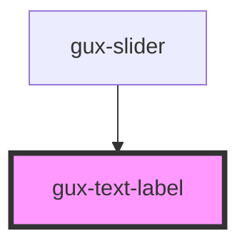

# gux-text-label

A styled label element typically used in conjunction with input controls.  The label allows take either a string label or a set of dom elements as a label slot.

<!-- Auto Generated Below -->

## Properties

| Property   | Attribute  | Description                                                                                                                | Type                  | Default     |
| ---------- | ---------- | -------------------------------------------------------------------------------------------------------------------------- | --------------------- | ----------- |
| `label`    | `label`    | The string of text to use for the label.  If the 'label' slot is provided, that dom will be used instead of this property. | `string`              | `undefined` |
| `position` | `position` | The position of the label relative to its contained element.                                                               | `"above" \| "beside"` | `'above'`   |

## Dependencies

### Used by

 - [gux-slider](../gux-slider)

### Graph

----------------------------------------------

*Built with [StencilJS](https://stenciljs.com/)*
