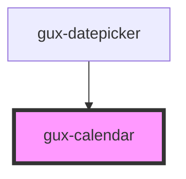

# genesys-calendar

This is a simple calendar component, that allows the user to select a date.

<!-- Auto Generated Below -->

## Properties

| Property         | Attribute           | Description                                         | Type                   | Default                                                                     |
| ---------------- | ------------------- | --------------------------------------------------- | ---------------------- | --------------------------------------------------------------------------- |
| `firstDayOfWeek` | `first-day-of-week` | The calendar first week day (default to 0 (sunday)) | `number`               | `0`                                                                         |
| `locale`         | `locale`            | The calendar locale (default to browser locale)     | `string`               | `navigator.languages     ? navigator.languages[0]     : navigator.language` |
| `mode`           | `mode`              | The calendar mode (can be single or range)          | `string`               | `CalendarModes.Single`                                                      |
| `numberOfMonths` | `number-of-months`  | The calendar number of months displayed             | `number`               | `1`                                                                         |
| `value`          | --                  | The calendar current selected date                  | `Date \| [Date, Date]` | `new Date()`                                                                |

## Events

| Event   | Description                        | Type                                |
| ------- | ---------------------------------- | ----------------------------------- |
| `input` | Triggered when user selects a date | `CustomEvent<Date \| [Date, Date]>` |

## Methods

### `focusPreviewDate() => Promise<void>`

Focus the preview date

#### Returns

Type: `Promise<void>`

### `setValue(value: Date | [Date, Date]) => Promise<void>`

Sets new value and rerender the calendar

#### Returns

Type: `Promise<void>`

## Dependencies

### Used by

 - [gux-datepicker](../gux-datepicker)

### Graph

----------------------------------------------

*Built with [StencilJS](https://stenciljs.com/)*
