# gux-icon

<!-- Auto Generated Below -->

## Properties

| Property           | Attribute           | Description                                                                           | Type      | Default     |
| ------------------ | ------------------- | ------------------------------------------------------------------------------------- | --------- | ----------- |
| `decorative`       | `decorative`        | Indicate whether the icon should be ignored by accessibility tools or not             | `boolean` | `false`     |
| `iconName`         | `icon-name`         | Indicate which icon to display                                                        | `string`  | `undefined` |
| `screenreaderText` | `screenreader-text` | Localized text describing the intent of this icon (not required if `decorative=true`) | `string`  | `undefined` |

## Dependencies

### Used by

 - [gux-accordion](../gux-accordion)
 - [gux-action-button](../gux-action-button)
 - [gux-action-toast](../gux-action-toast)
 - [gux-advanced-dropdown](../gux-advanced-dropdown)
 - [gux-calendar](../gux-calendar)
 - [gux-color-picker](../gux-color-picker)
 - [gux-datepicker](../gux-datepicker)
 - [gux-disclosure-button](../gux-disclosure-button)
 - [gux-dropdown](../gux-dropdown)
 - [gux-modal](../gux-modal)
 - [gux-notification-toast](../gux-notification-toast)
 - [gux-pagination-buttons](../gux-pagination/buttons)
 - [gux-popover](../gux-popover)
 - [gux-search](../gux-search)
 - [gux-side-panel-button](../gux-side-panel/buttons)
 - [gux-simple-toast](../gux-simple-toast)
 - [gux-spin-button](../gux-spin-button)
 - [gux-tabs](../gux-tabs)
 - [gux-text-field](../gux-text-field)

### Graph

```mermaid
graph TD;
  gux-accordion --> gux-icon
  gux-action-button --> gux-icon
  gux-action-toast --> gux-icon
  gux-advanced-dropdown --> gux-icon
  gux-calendar --> gux-icon
  gux-color-picker --> gux-icon
  gux-datepicker --> gux-icon
  gux-disclosure-button --> gux-icon
  gux-dropdown --> gux-icon
  gux-modal --> gux-icon
  gux-notification-toast --> gux-icon
  gux-pagination-buttons --> gux-icon
  gux-popover --> gux-icon
  gux-search --> gux-icon
  gux-side-panel-button --> gux-icon
  gux-simple-toast --> gux-icon
  gux-spin-button --> gux-icon
  gux-tabs --> gux-icon
  gux-text-field --> gux-icon
  style gux-icon fill:#f9f,stroke:#333,stroke-width:4px
```

----------------------------------------------

*Built with [StencilJS](https://stenciljs.com/)*
