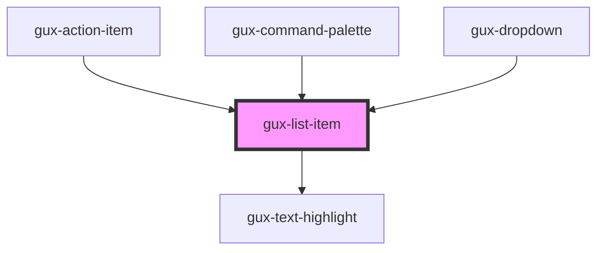

# gux-list-item
A list item to display in a list. The content of this can either be slotted in or driven by the text attribute.

Example of a standard list item
```html
<gux-list-item text="Hello World" value="hw" />
```

Example of a custom list item with highlighting
```html
<gux-list-item value="hw"><i>Testing</i><gux-text-highlight text="Hello World"/></gux-list-item>
```


<!-- Auto Generated Below -->


## Properties

| Property   | Attribute  | Description                          | Type                                                                               | Default     |
| ---------- | ---------- | ------------------------------------ | ---------------------------------------------------------------------------------- | ----------- |
| `strategy` | `strategy` | How the item should be highlighted.  | `HighlightStrategy.Contains \| HighlightStrategy.Fuzzy \| HighlightStrategy.Start` | `undefined` |
| `text`     | `text`     | The value to display.                | `string`                                                                           | `undefined` |
| `value`    | `value`    | The value associated with this item. | `any`                                                                              | `undefined` |


## Events

| Event   | Description                                                     | Type               |
| ------- | --------------------------------------------------------------- | ------------------ |
| `press` | Emits when the list item is clicked, or enter/space is pressed. | `CustomEvent<any>` |


## Dependencies

### Used by

 - [gux-action-item](../../gux-action-button/gux-action-item)
 - [gux-command-palette](../../gux-command-palette)
 - [gux-dropdown](../../gux-dropdown)

### Depends on

- [gux-text-highlight](../../gux-text-highlight)

### Graph


----------------------------------------------

*Built with [StencilJS](https://stenciljs.com/)*
