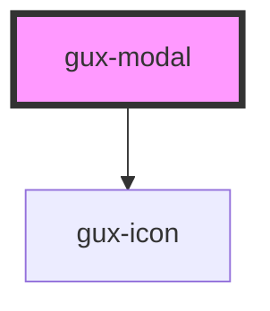

# genesys-modal

<!-- Auto Generated Below -->

## Properties

| Property | Attribute | Description                                              | Type                             | Default   |
| -------- | --------- | -------------------------------------------------------- | -------------------------------- | --------- |
| `size`   | `size`    | Indicates the size of the modal (small, medium or large) | `"large" \| "medium" \| "small"` | `'small'` |

## Events

| Event        | Description                           | Type                |
| ------------ | ------------------------------------- | ------------------- |
| `guxdismiss` | Fired when a user dismisses the modal | `CustomEvent<void>` |

## Slots

| Slot                    | Description                                                       |
| ----------------------- | ----------------------------------------------------------------- |
| `"content"`             | Required slot for the modal content                               |
| `"left-align-buttons"`  | Optional slot to set gux-buttons aligned to the left of the modal |
| `"right-align-buttons"` | Optional slot to set gux-buttons aligned to the left of the modal |
| `"title"`               | Optional slot to set the modal title                              |

## Dependencies

### Depends on

- [gux-icon](../gux-icon)

### Graph

----------------------------------------------

*Built with [StencilJS](https://stenciljs.com/)*
