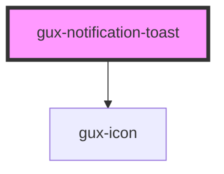

# gux-notification-toast

Lorem ipsum dolor sit amet, consectetur adipiscing elit, sed do eiusmod tempor incididunt ut labore et dolore magna aliqua. Ut enim ad minim veniam, quis nostrud exercitation ullamco laboris nisi ut aliquip ex ea commodo consequat. Duis aute irure dolor in reprehenderit in voluptate velit esse cillum dolore eu fugiat nulla pariatur. Excepteur sint occaecat cupidatat non proident, sunt in culpa qui officia deserunt mollit anim id est laborum. 

<!-- Auto Generated Below -->

## Properties

| Property     | Attribute     | Description                                               | Type                         | Default                    |
| ------------ | ------------- | --------------------------------------------------------- | ---------------------------- | -------------------------- |
| `accent`     | `accent`      | The component accent (alert warning positive or neutral). | `string`                     | `'neutral'`                |
| `i18n`       | --            | Indicate the localisation strings                         | `{ [key: string]: string; }` | `{     close: 'close'   }` |
| `icon`       | `icon`        | The icon name of the title.                               | `string`                     | `undefined`                |
| `iconUri`    | `icon-uri`    | The icon uri of the title.                                | `string`                     | `undefined`                |
| `idToast`    | `id-toast`    | The id of the title.                                      | `string`                     | `undefined`                |
| `message`    | `message`     | The message of the toast.                                 | `string`                     | `undefined`                |
| `toastTitle` | `toast-title` | The toast title.                                          | `string`                     | `undefined`                |

## Events

| Event        | Description | Type               |
| ------------ | ----------- | ------------------ |
| `closeClick` |             | `CustomEvent<any>` |

## Dependencies

### Depends on

- [gux-icon](../gux-icon)

### Graph

----------------------------------------------

*Built with [StencilJS](https://stenciljs.com/)*
