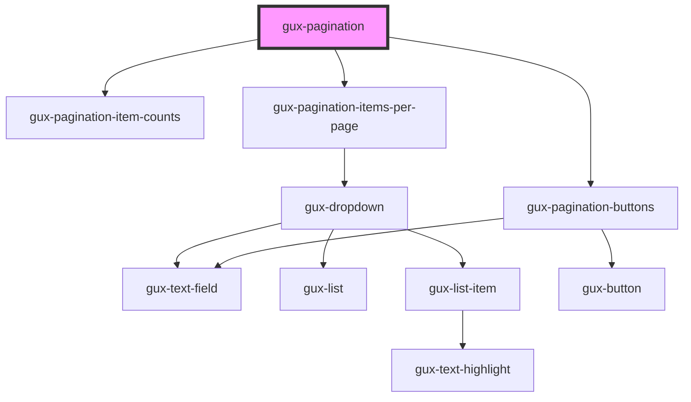

# gux-pagination

A pagination control intended to be used underneath a table or grid with paged
content. Given a total number of items, the view will automatically calculate
a total number of pages (you can optionally supply the number of items per page
and/or initial starting page).

When a user changes pages, the component will emit a `pageChanged` event with
the newly selected page.

<!-- Auto Generated Below -->

## Properties

| Property              | Attribute        | Description                                                                                                                                                                | Type       | Default                     |
| --------------------- | ---------------- | -------------------------------------------------------------------------------------------------------------------------------------------------------------------------- | ---------- | --------------------------- |
| `currentPage`         | `current-page`   | The currently select page. Changes are watched by the component.                                                                                                           | `number`   | `1`                         |
| `itemsPerPage`        | `items-per-page` |                                                                                                                                                                            | `number`   | `25`                        |
| `itemsPerPageOptions` | --               |                                                                                                                                                                            | `number[]` | `[25, 50, 100]`             |
| `layout`              | `layout`         | The responsive size of the control to use: "small", "medium", or "large". See the exported recommendedBreakpoints for the pixel widths that are recommended for each size. | `string`   | `GuxPaginationLayout.Large` |
| `totalItems`          | `total-items`    | The total number of items in the data set. Used to calculate total page count                                                                                              | `number`   | `undefined`                 |

## Events

| Event                 | Description                                             | Type                  |
| --------------------- | ------------------------------------------------------- | --------------------- |
| `itemsPerPageChanged` | Fired when user selects a new number of items per page. | `CustomEvent<number>` |
| `pageChanged`         | Fired when the current page property changes.           | `CustomEvent<number>` |

## Methods

### `setItemsPerPage(value: number, options?: number[]) => Promise<void>`

Sets the number of items to display on a single page, and optionally the list
of items that the user can choose from in the dropdown.

If options are omitted, the user selection dropdown won't be displayed.

#### Returns

Type: `Promise<void>`

### `setPage(page: number) => Promise<void>`

#### Returns

Type: `Promise<void>`

## Dependencies

### Depends on

- [gux-pagination-item-counts](item-counts)
- [gux-pagination-items-per-page](items-per-page)
- [gux-pagination-buttons](buttons)

### Graph

----------------------------------------------

*Built with [StencilJS](https://stenciljs.com/)*
