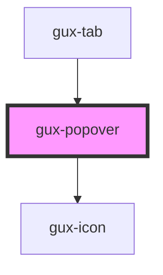

# gux-popover

## Possible Improvements

- add a dark theme. There is currently none in the style guide (No Jira)
- add a gux-popover-paragraph component with title and content slots (No Jira)
- add a gux-popover-list component and gux-popover-list-option component (No Jira)
  - It may be possible to use gux-list for this.

<!-- Auto Generated Below -->

## Properties

| Property               | Attribute                | Description                                                                          | Type                                                                                                                                                                 | Default     |
| ---------------------- | ------------------------ | ------------------------------------------------------------------------------------ | -------------------------------------------------------------------------------------------------------------------------------------------------------------------- | ----------- |
| `closeOnClickOutside`  | `close-on-click-outside` | Close popover when the user clicks outside of its bounds                             | `boolean`                                                                                                                                                            | `false`     |
| `displayDismissButton` | `display-dismiss-button` | Indicate if the dismiss button is displayed                                          | `boolean`                                                                                                                                                            | `undefined` |
| `for`                  | `for`                    | Indicates the id of the element the popover should anchor to                         | `string`                                                                                                                                                             | `undefined` |
| `position`             | `position`               | Indicate position of popover element arrow (follow popper js position attribute api) | `"bottom" \| "bottom-end" \| "bottom-start" \| "left" \| "left-end" \| "left-start" \| "right" \| "right-end" \| "right-start" \| "top" \| "top-end" \| "top-start"` | `'bottom'`  |

## Events

| Event        | Description                             | Type                |
| ------------ | --------------------------------------- | ------------------- |
| `guxdismiss` | Fired when a user dismisses the popover | `CustomEvent<void>` |

## Dependencies

### Used by

 - [gux-tab](../gux-tabs/gux-tab)

### Depends on

- [gux-icon](../gux-icon)

### Graph

----------------------------------------------

*Built with [StencilJS](https://stenciljs.com/)*
