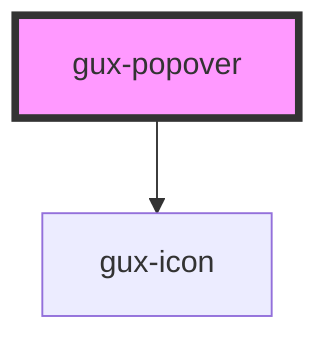

# gux-popover

<!-- Auto Generated Below -->

## Properties

| Property    | Attribute    | Description                                                                          | Type                                                                                                                                                                 | Default     |
| ----------- | ------------ | ------------------------------------------------------------------------------------ | -------------------------------------------------------------------------------------------------------------------------------------------------------------------- | ----------- |
| `for`       | `for`        | Indicates the id of the element the popover should anchor to                         | `string`                                                                                                                                                             | `undefined` |
| `hidden`    | `hidden`     | Indicate if the popover is hidden                                                    | `boolean`                                                                                                                                                            | `false`     |
| `hideClose` | `hide-close` | Indicate if the close button is displayed                                            | `boolean`                                                                                                                                                            | `undefined` |
| `position`  | `position`   | Indicate position of popover element arrow (follow popper js position attribute api) | `"bottom" \| "bottom-end" \| "bottom-start" \| "left" \| "left-end" \| "left-start" \| "right" \| "right-end" \| "right-start" \| "top" \| "top-end" \| "top-start"` | `'top'`     |

## Events

| Event   | Description                                  | Type               |
| ------- | -------------------------------------------- | ------------------ |
| `close` | Triggered when the close button gets clicked | `CustomEvent<any>` |

## Dependencies

### Depends on

- [gux-icon](../gux-icon)

### Graph

----------------------------------------------

*Built with [StencilJS](https://stenciljs.com/)*
