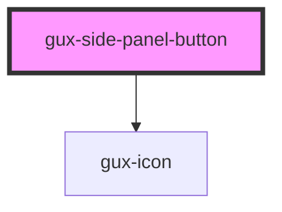

# gux-pagination-buttons

An internal component used by the gux-pagination component.

<!-- Auto Generated Below -->

## Properties

| Property     | Attribute     | Description | Type      | Default     |
| ------------ | ------------- | ----------- | --------- | ----------- |
| `altText`    | `alt-text`    |             | `string`  | `undefined` |
| `icon`       | `icon`        |             | `string`  | `undefined` |
| `isSelected` | `is-selected` |             | `boolean` | `false`     |

## Dependencies

### Depends on

- [gux-icon](../../gux-icon)

### Graph

----------------------------------------------

*Built with [StencilJS](https://stenciljs.com/)*
