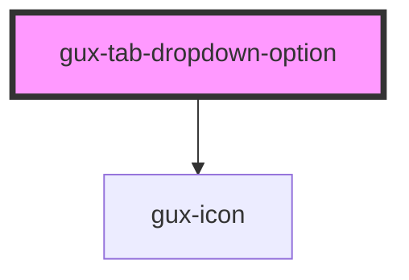

# gux-tab-dropdown-option

<!-- Auto Generated Below -->

## Properties

| Property   | Attribute   | Description                                    | Type     | Default     |
| ---------- | ----------- | ---------------------------------------------- | -------- | ----------- |
| `iconName` | `icon-name` | name of the gux-icon to display for the option | `string` | `undefined` |
| `optionId` | `option-id` | unique id for the option                       | `string` | `undefined` |

## Dependencies

### Depends on

- [gux-icon](../../gux-icon)

### Graph

----------------------------------------------

*Built with [StencilJS](https://stenciljs.com/)*
