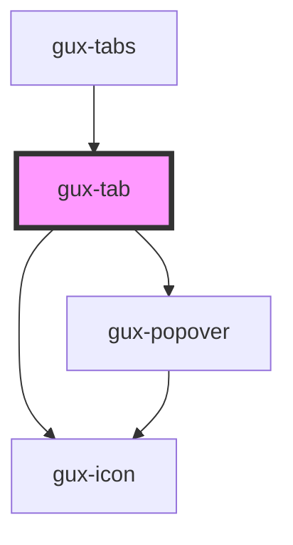

# gux-tab

<!-- Auto Generated Below -->

## Properties

| Property   | Attribute  | Description | Type      | Default |
| ---------- | ---------- | ----------- | --------- | ------- |
| `index`    | `index`    |             | `number`  | `0`     |
| `selected` | `selected` |             | `boolean` | `false` |
| `title`    | `title`    |             | `string`  | `''`    |

## Dependencies

### Used by

 - [gux-tabs](..)

### Depends on

- [gux-icon](../../gux-icon)
- [gux-popover](../../gux-popover)

### Graph

----------------------------------------------

*Built with [StencilJS](https://stenciljs.com/)*
