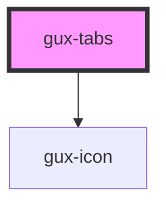

# gux-tabs

<!-- Auto Generated Below -->

## Properties

| Property    | Attribute    | Description                     | Type      | Default |
| ----------- | ------------ | ------------------------------- | --------- | ------- |
| `allowSort` | `allow-sort` | Enable tab sorting by drag/drop | `boolean` | `true`  |

## Events

| Event         | Description                                       | Type               |
| ------------- | ------------------------------------------------- | ------------------ |
| `input`       |                                                   | `CustomEvent<any>` |
| `newTab`      | Triggers when the new tab button is selected.     | `CustomEvent<any>` |
| `sortChanged` | Triggers when the sorting of the tabs is changed. | `CustomEvent<any>` |

## Dependencies

### Depends on

- [gux-icon](../gux-icon)

### Graph

----------------------------------------------

*Built with [StencilJS](https://stenciljs.com/)*
