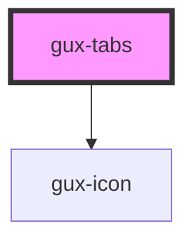

# gux-tabs

<!-- Auto Generated Below -->

## Events

| Event         | Description                                       | Type               |
| ------------- | ------------------------------------------------- | ------------------ |
| `newTab`      | Triggers when the new tab button is selected.     | `CustomEvent<any>` |
| `sortChanged` | Triggers when the sorting of the tabs is changed. | `CustomEvent<any>` |

## Dependencies

### Depends on

- [gux-icon](../gux-icon)

### Graph

----------------------------------------------

*Built with [StencilJS](https://stenciljs.com/)*
