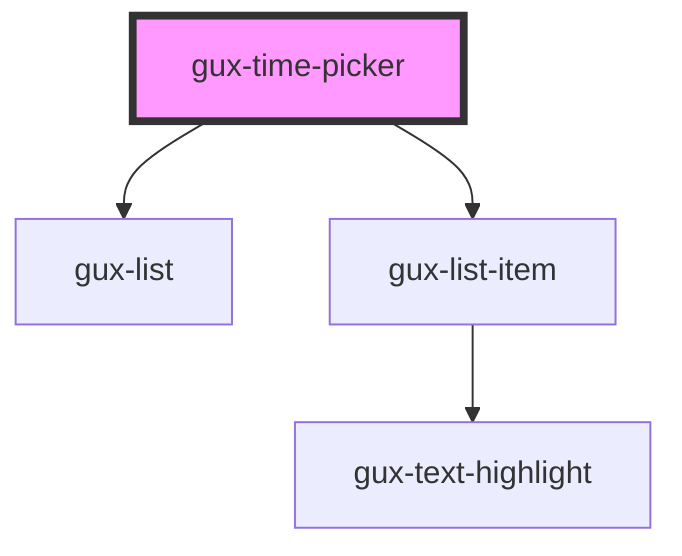

# gux-toggle

This is a basic toggle using a html checkbox component in it.
If the checkedLabel and uncheckedLabel are specified, label apears on the right of the component.
You can use keyboard to change the state of the component.
Space key and enter key are binded.
This component supports dark theme mode also.
A check event is triggered when the state of the component changed.

<!-- Auto Generated Below -->

## Properties

| Property   | Attribute  | Description | Type     | Default            |
| ---------- | ---------- | ----------- | -------- | ------------------ |
| `interval` | `interval` |             | `number` | `DEFAULT_INTERVAL` |
| `max`      | `max`      |             | `string` | `MAX_TIME`         |
| `min`      | `min`      |             | `string` | `MIN_TIME`         |
| `value`    | `value`    |             | `string` | `''`               |

## Events

| Event     | Description | Type               |
| --------- | ----------- | ------------------ |
| `changed` |             | `CustomEvent<any>` |

## Dependencies

### Depends on

- [gux-list](../gux-list)
- [gux-list-item](../gux-list/list-item)

### Graph

----------------------------------------------

*Built with [StencilJS](https://stenciljs.com/)*
