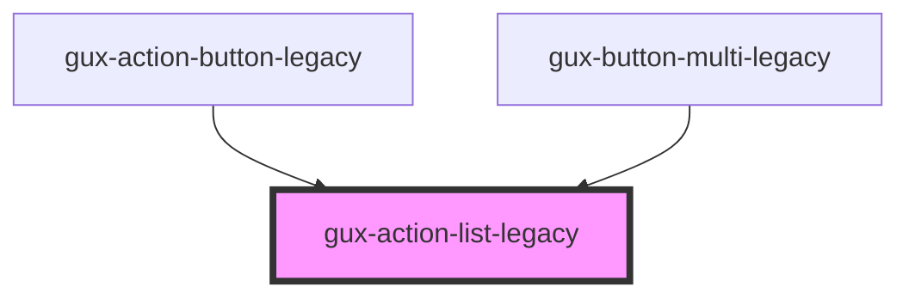

# gux-action-list

A list element. In order to use this element list contents must be slotted in.

Example usage

```html
<gux-action-list>
  <gux-action-list-item value="test" text="test1" />
  <gux-action-list-divider />
  <gux-action-list-item value="test" text="test2" />
  <gux-action-list-item value="test" text="test3" />
</gux-action-list>
```

Example with slotting

```html
<gux-action-list>
  <gux-action-list-item
    ><span>⌘</span><gux-text-highlight text="test"
  /></gux-action-list-item>
</gux-action-list>
```

<!-- Auto Generated Below -->


## Methods

### `isFirstItemSelected() => Promise<boolean>`

Returns whether the first item in the list is selected.

#### Returns

Type: `Promise<boolean>`


### `isLastItemSelected() => Promise<boolean>`

Returns whether the last item in the list is selected.

#### Returns

Type: `Promise<boolean>`


### `setFocusOnFirstItem() => Promise<void>`


#### Returns

Type: `Promise<void>`


### `setFocusOnLastItem() => Promise<void>`


#### Returns

Type: `Promise<void>`


## Dependencies

### Used by

 - [gux-action-button-legacy](../gux-action-button-legacy)
 - [gux-button-multi-legacy](../gux-button-multi-legacy)

### Graph


----------------------------------------------

*Built with [StencilJS](https://stenciljs.com/)*
