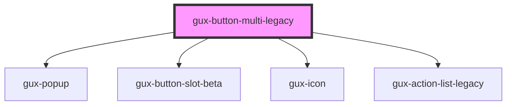

# gux-button-multi-legacy

<!-- Auto Generated Below -->

## Properties

| Property   | Attribute  | Description                                  | Type                                                | Default       |
| ---------- | ---------- | -------------------------------------------- | --------------------------------------------------- | ------------- |
| `accent`   | `accent`   | The component accent (secondary or primary). | `"ghost" \| "primary" \| "secondary" \| "tertiary"` | `'secondary'` |
| `disabled` | `disabled` | Disables the action button.                  | `boolean`                                           | `false`       |
| `isOpen`   | `is-open`  | It is used to open or not the list.          | `boolean`                                           | `false`       |
| `text`     | `text`     | The component text.                          | `string`                                            | `undefined`   |

## Events

| Event   | Description                      | Type               |
| ------- | -------------------------------- | ------------------ |
| `close` | Triggered when the menu is close | `CustomEvent<any>` |
| `open`  | Triggered when the menu is open  | `CustomEvent<any>` |

## Dependencies

### Depends on

- [gux-popup](../../stable/gux-popup)
- [gux-button-slot-beta](../../beta/gux-button-slot)
- [gux-icon](../../stable/gux-icon)
- [gux-action-list-legacy](../gux-action-list-legacy)

### Graph

----------------------------------------------

*Built with [StencilJS](https://stenciljs.com/)*
