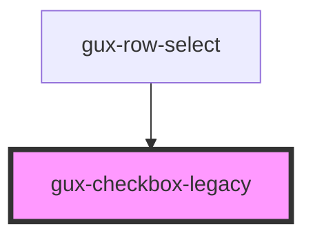

# gux-checkbox-legacy

This component represents a checkbox with three possible states: `unchecked`, `checked`, and `indeterminate`.  The third state, `indeterminate`, is intended to represent when a checkboxes state is 'mixed', often when a checkbox has child items.

## Usage Examples

### Standard Checkboxes

```
<gux-checkbox-legacy checked>An unchecked checkbox</gux-checkbox-legacy>
<gux-checkbox-legacy checked>A checked checkbox</gux-checkbox-legacy>
```

### Indeterminate Checkboxes

```
<gux-checkbox-legacy class="parent" indeterminate>

<!-- NOTE: The gux-checkbox-betaes don't actually interact with eachother, so you need to add your own logic to update the state of the parent checkbox>
<div class="children">
  <gux-checkbox-legacy checked>An unchecked checkbox</gux-checkbox-legacy>
  <gux-checkbox-legacy checked>A checked checkbox</gux-checkbox-legacy>
</div>
```

<!-- Auto Generated Below -->


## Properties

| Property        | Attribute       | Description                                                                                                 | Type      | Default     |
| --------------- | --------------- | ----------------------------------------------------------------------------------------------------------- | --------- | ----------- |
| `checked`       | `checked`       | Whether or not the checkbox is checked.  Ignored when in an `indeterminate` state.                          | `boolean` | `undefined` |
| `disabled`      | `disabled`      | Whether of not the checkbox input is disabled.                                                              | `boolean` | `undefined` |
| `indeterminate` | `indeterminate` | If true, the checkbox will be displayed in an indeterminate state, and the `checked` value will be ignored. | `boolean` | `undefined` |


## Events

| Event   | Description                           | Type                   |
| ------- | ------------------------------------- | ---------------------- |
| `check` | Emits when the checked state changes. | `CustomEvent<boolean>` |


## Dependencies

### Used by

 - [gux-row-select](../../beta/gux-table/gux-row-select)

### Graph


----------------------------------------------

*Built with [StencilJS](https://stenciljs.com/)*
