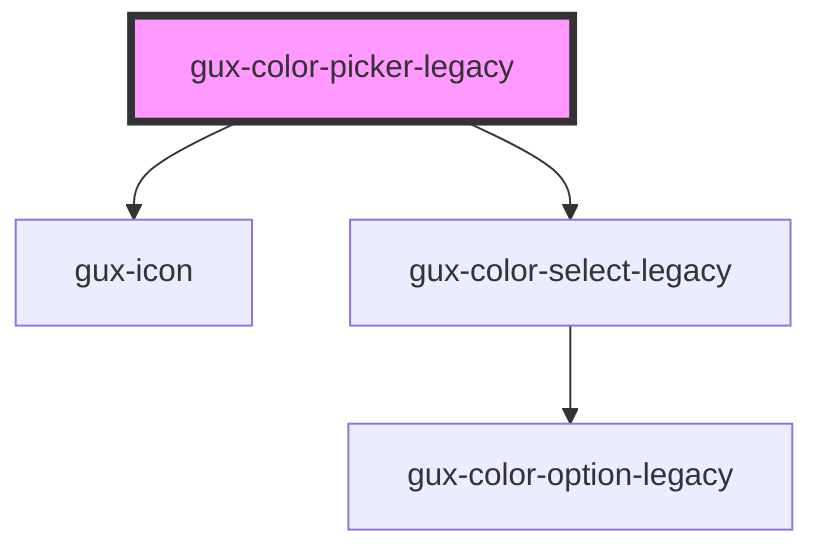

# gux-color-picker-legacy

<!-- Auto Generated Below -->

## Properties

| Property   | Attribute  | Description                                  | Type      | Default     |
| ---------- | ---------- | -------------------------------------------- | --------- | ----------- |
| `disabled` | `disabled` | Indicates if the dropdown is disabled or not | `boolean` | `undefined` |
| `value`    | `value`    | Determines the state activeColor             | `string`  | `undefined` |

## Events

| Event   | Description                       | Type               |
| ------- | --------------------------------- | ------------------ |
| `input` | Triggers when a color is selected | `CustomEvent<any>` |

## Dependencies

### Depends on

- [gux-icon](../../stable/gux-icon)
- [gux-color-select-legacy](../gux-color-select-legacy)

### Graph

----------------------------------------------

*Built with [StencilJS](https://stenciljs.com/)*
