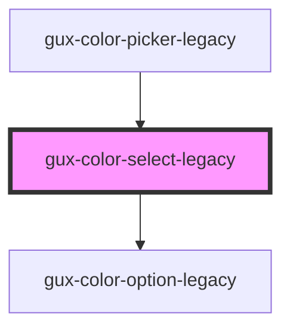

# gux-color-select-legacy

<!-- Auto Generated Below -->

## Properties

| Property | Attribute | Description                      | Type     | Default     |
| -------- | --------- | -------------------------------- | -------- | ----------- |
| `value`  | `value`   | Determines the state activeColor | `string` | `undefined` |

## Events

| Event   | Description                       | Type               |
| ------- | --------------------------------- | ------------------ |
| `input` | Triggers when a color is selected | `CustomEvent<any>` |

## Dependencies

### Used by

 - [gux-color-picker-legacy](../gux-color-picker-legacy)

### Depends on

- [gux-color-option-legacy](../gux-color-option-legacy)

### Graph

----------------------------------------------

*Built with [StencilJS](https://stenciljs.com/)*
