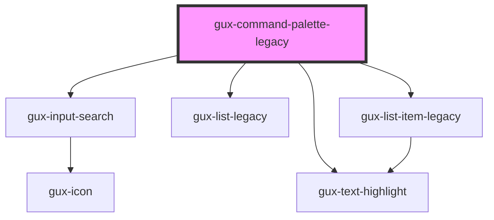

# gux-command-palette-legacy
A command palette. This control is used to display possible commands and allows for those commands to be triggered.

<!-- Auto Generated Below -->

## Methods

### `close() => Promise<void>`

Closes the command palette.

#### Returns

Type: `Promise<void>`

### `open() => Promise<void>`

Opens the command palette.

#### Returns

Type: `Promise<void>`

## Dependencies

### Depends on

- [gux-input-search](../../stable/gux-form-field/components/gux-input-search)
- [gux-list-legacy](../gux-list-legacy)
- [gux-list-item-legacy](../gux-list-legacy/list-item)
- [gux-text-highlight](../../stable/gux-text-highlight)

### Graph

----------------------------------------------

*Built with [StencilJS](https://stenciljs.com/)*
