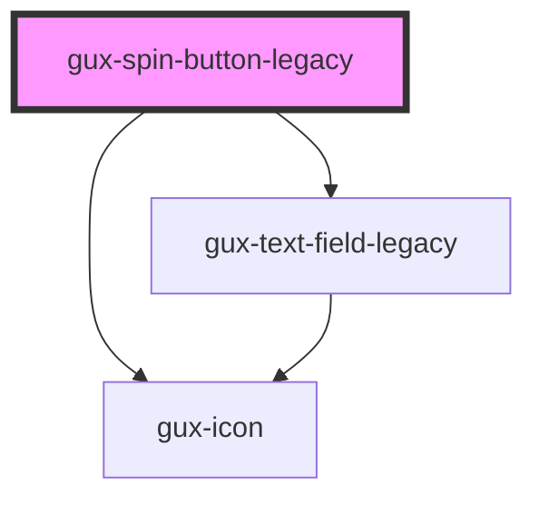

# gux-spin-button-legacy

<!-- Auto Generated Below -->

## Properties

| Property           | Attribute           | Description                                                     | Type      | Default     |
| ------------------ | ------------------- | --------------------------------------------------------------- | --------- | ----------- |
| `disabled`         | `disabled`          | If the component is disabled or not                             | `boolean` | `undefined` |
| `errorMessage`     | `error-message`     | The message shown to the user on an error                       | `string`  | `undefined` |
| `ignoreValidation` | `ignore-validation` | If the component should show validation warnings or not         | `boolean` | `undefined` |
| `max`              | `max`               | the maximum number the value can be when using the spin buttons | `number`  | `undefined` |
| `min`              | `min`               | The minimum number the value can be when using the spin buttons | `number`  | `undefined` |
| `step`             | `step`              | The number which the value increments / decrements              | `number`  | `undefined` |
| `value`            | `value`             | The current number value of the text field                      | `number`  | `undefined` |

## Events

| Event   | Description                 | Type                  |
| ------- | --------------------------- | --------------------- |
| `input` | Triggered when user inputs. | `CustomEvent<number>` |

## Methods

### `validate() => Promise<boolean>`

Checks if the component is valid

#### Returns

Type: `Promise<boolean>`

## Dependencies

### Depends on

- [gux-text-field-legacy](../gux-text-field-legacy)
- [gux-icon](../../stable/gux-icon)

### Graph

----------------------------------------------

*Built with [StencilJS](https://stenciljs.com/)*
