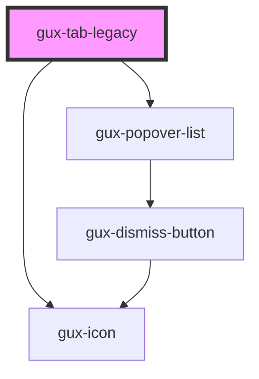

# gux-tab-legacy

<!-- Auto Generated Below -->

## Properties

| Property      | Attribute       | Description                                                                                         | Type      | Default     |
| ------------- | --------------- | --------------------------------------------------------------------------------------------------- | --------- | ----------- |
| `active`      | `active`        | indicates whether or not the tab is selected                                                        | `boolean` | `false`     |
| `tabIconName` | `tab-icon-name` | indicates the gux-icon to display on the left side of the tab (similar to a favicon in the browser) | `string`  | `undefined` |
| `tabId`       | `tab-id`        | unique id for the tab                                                                               | `string`  | `undefined` |

## Events

| Event                 | Description | Type                |
| --------------------- | ----------- | ------------------- |
| `internaltabselected` |             | `CustomEvent<void>` |

## Dependencies

### Depends on

- [gux-icon](../../../stable/gux-icon)
- [gux-popover-list](../../../beta/gux-popover-list)

### Graph

----------------------------------------------

*Built with [StencilJS](https://stenciljs.com/)*
