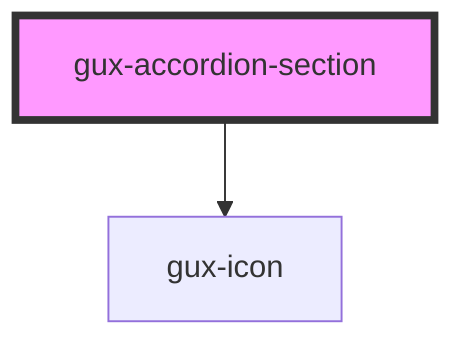

# gux-accordion

<!-- Auto Generated Below -->

## Properties

| Property          | Attribute          | Description | Type                         | Default     |
| ----------------- | ------------------ | ----------- | ---------------------------- | ----------- |
| `arrowPosition`   | `arrow-position`   |             | `"beside-text" \| "default"` | `'default'` |
| `disabled`        | `disabled`         |             | `boolean`                    | `false`     |
| `open`            | `open`             |             | `boolean`                    | `false`     |
| `reverseHeadings` | `reverse-headings` |             | `boolean`                    | `false`     |

## Events

| Event                   | Description | Type                |
| ----------------------- | ----------- | ------------------- |
| `internalsectionopened` |             | `CustomEvent<void>` |

## Slots

| Slot          | Description                     |
| ------------- | ------------------------------- |
| `"header"`    | Required slot for the heading   |
| `"icon"`      | Optional slot for an icon       |
| `"subheader"` | Optional slot for a subheader * |

## Dependencies

### Depends on

- [gux-icon](../../gux-icon)

### Graph

----------------------------------------------

*Built with [StencilJS](https://stenciljs.com/)*
