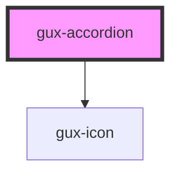

# gux-accordion

<!-- Auto Generated Below -->

## Properties

| Property        | Attribute        | Description                                                                                                                               | Type                         | Default     |
| --------------- | ---------------- | ----------------------------------------------------------------------------------------------------------------------------------------- | ---------------------------- | ----------- |
| `arrowPosition` | `arrow-position` |                                                                                                                                           | `"beside-text" \| "default"` | `'default'` |
| `headingLevel`  | `heading-level`  | The heading level within the page the accordion section headers should be set to. heading-level="3" woudl be equivalent to an h3 element. | `number`                     | `null`      |

## Methods

### `close(slotName: string) => Promise<void>`

Closes a section.

#### Returns

Type: `Promise<void>`

### `open(slotName: string) => Promise<void>`

Opens a section.

#### Returns

Type: `Promise<void>`

### `toggle(slotName: string) => Promise<void>`

Toggles a section.

#### Returns

Type: `Promise<void>`

## Dependencies

### Depends on

- [gux-icon](../gux-icon)

### Graph

----------------------------------------------

*Built with [StencilJS](https://stenciljs.com/)*
