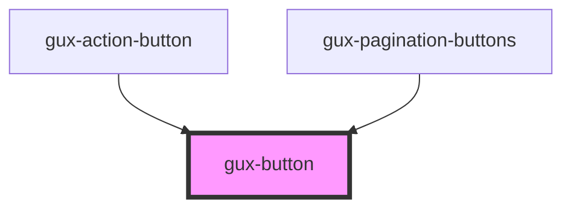

# gux-button

This custom component is a simple button having some styling on it.
You can choose between two type (secondary and primary).

<!-- Auto Generated Below -->

## Properties

| Property   | Attribute  | Description                                  | Type                                     | Default       |
| ---------- | ---------- | -------------------------------------------- | ---------------------------------------- | ------------- |
| `accent`   | `accent`   | The component accent (secondary or primary). | `"primary" \| "secondary" \| "tertiary"` | `'secondary'` |
| `disabled` | `disabled` | Indicate if the button is disabled or not    | `boolean`                                | `false`       |
| `title`    | `title`    | The component title                          | `string`                                 | `undefined`   |
| `type`     | `type`     | The component button type                    | `"button" \| "reset" \| "submit"`        | `'button'`    |

## Dependencies

### Used by

 - [gux-action-button](../gux-action-button)
 - [gux-pagination-buttons](../gux-pagination/gux-pagination-buttons)

### Graph

----------------------------------------------

*Built with [StencilJS](https://stenciljs.com/)*
